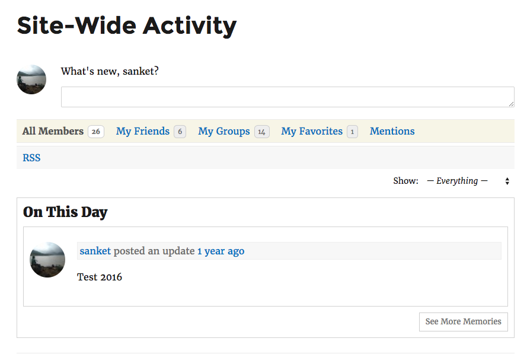
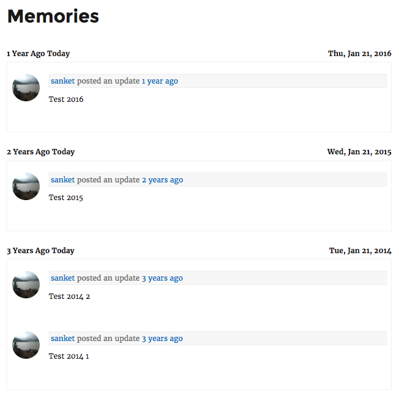

<!-- DO NOT EDIT THIS FILE; it is auto-generated from readme.txt -->
# BP Memories

Using BP Memories you can see your memory regarding BuddyPress such as activity.

**Contributors:** [sanket.parmar](https://profiles.wordpress.org/sanket.parmar)  
**Tags:** [buddypress](https://wordpress.org/plugins/tags/buddypress), [memories](https://wordpress.org/plugins/tags/memories), [bp-memories](https://wordpress.org/plugins/tags/bp-memories), [memory](https://wordpress.org/plugins/tags/memory)  
**Requires at least:** WordPress 4.0  
**Tested up to:** WordPress 4.7.2  
**Stable tag:** 1.0.0  
**License:** [GPLv2 or later](http://www.gnu.org/licenses/gpl-2.0.html)  

## Description ##

BP Memories plugin is useful to see your memory regarding BuddyPress such as activity.

If you really like this plugin, you can rate here -> https://wordpress.org/support/plugin/bp-memories/reviews#new-topic-0

## Installation ##

### From your WordPress dashboard ###
1. Visit 'Plugins > Add New'
2. Search for 'BP Memories'
3. Activate BP Memories from your Plugins page.

### From WordPress.org ###
1. Download BP Memories.
2. Upload the 'bp-memories.zip' directory to your '/wp-content/plugins/' directory, using your favorite method (ftp, sftp, scp, etc...)
3. Activate BP Memories from your Plugins page.

## Frequently Asked Questions ##

### Can I use my existing WordPress theme? ###
Yes! BP Memories works out-of-the-box with nearly every BuddyPress supported theme.

## Screenshots ##

### On This Day on Site-Wide Activity page

### Memories

### No memories found

## Changelog ##

### 1.0 ###
* Initial Release
* Display activity memories

## Upgrade Notice ##

### 1.0 ###
Initial Release, Display activity memories.

